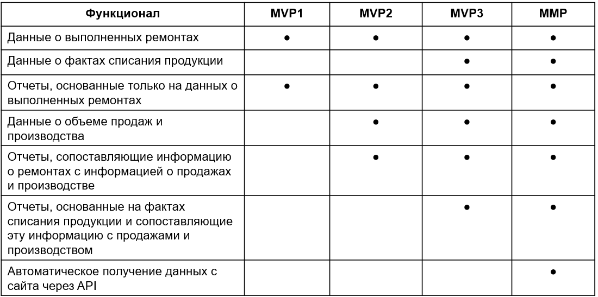
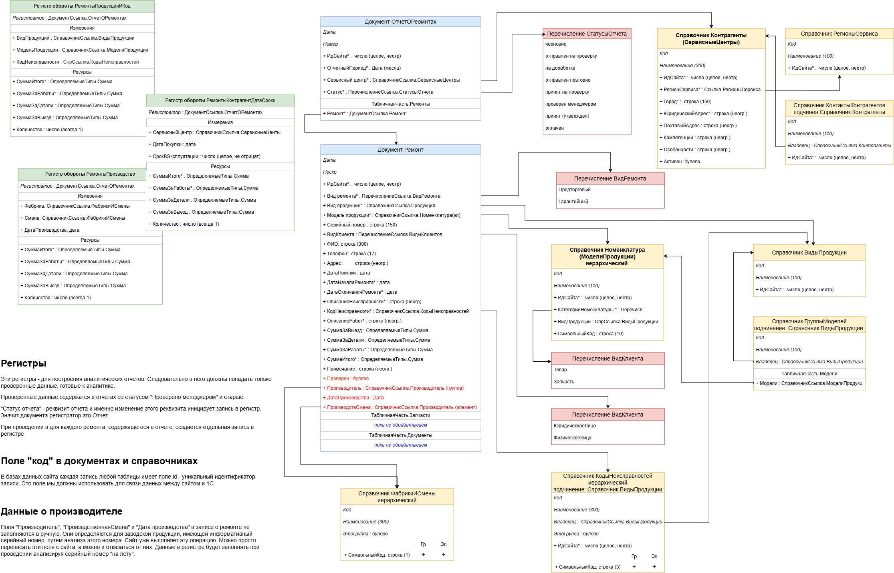
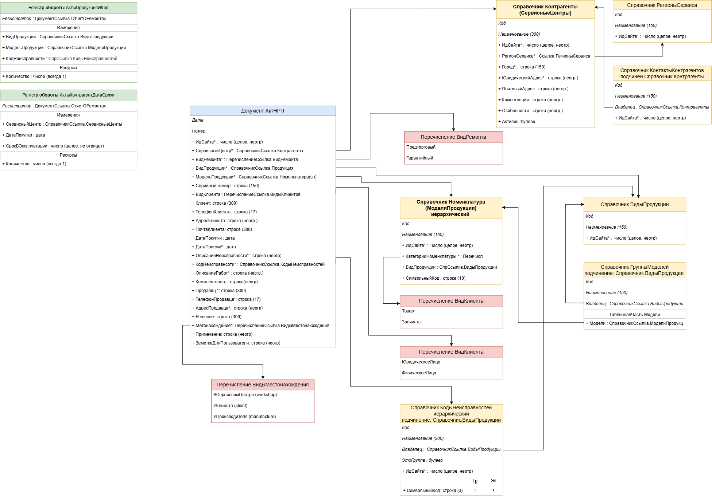

# База данных о гарантийных и сервисных ремонтах продукции компании

**Проблема:** web-сайт организации (https://renova-service.ru/) содержит данные о гарантийных и сервисных ремонтах реализуемой продукции. Для анализа статистики брака выполняется выгрузка данных в Excel и ручное построение сводных таблиц и графиков. На подготовку такого отчета уходит от трёх дней работы менеджера.

**Решение:** разработка и внедрение кастомной конфигурации 1С: Предприятие 8, выполняющей получение данных с web-сайта, хранение данных и построение требуемых отчетов.

**Предыстория:** разработка является продолжением развития системы управления сервисной отчетностью. Эволюция решений начиналась с Excel-таблиц, затем - desktop-приложение Delphi+MS SQL (https://github.com/shagi80/Delphi-SQL_service_base), после - web-сервис Python/Django (https://github.com/shagi80/Django_service_reports), сейчас - конфигурация 1С:Предприятие 8.

**Достижение:** внедрение конфигурации позволило:
- повысить скорость составления отчетности с трёх дней до одного часа;
- сделать отчетность доступной и прозрачной для любого заинтересованного пользователя.

Сквозная автоматизация workflow работы с сервисной отчетностью (разработка и внедрение web-сайта для сбора отчетности, разработка и внедрение 1С-конфигурации для анализа отчетности) позволила сократить штат сервисной службы с пяти до двух человек.

## Процесс разработки

Работа велась в формате учебно-практического проекта на базе реального бизнес-заказчика (ТМ «Renova» https://www.re-nova.com/). Команда — студенты курса «1С-разработчик» (Netology). Инструмент командной разработки — 1С:EDT 2024.1.3.

## Моя роль:

- **собрал команду разработки**  - выступил как product-owner. Определил требования и приоритеты;
- **в качестве project-manager** организовал работу команды по методологии SCRUM, довел проект до MVP3 (см ниже);
- **самостоятельно реализовал взаимодействие с web-сервисом** - описал endpoints на стороне сайта (DRF) и функционал http-запросов и обновления данных в конфигурации;
- **разработал подсистему "Отчеты"** - создал кастомную форму отчетов с динамической сортировкой результата "по кнопке" и раздельным выводом таблиц и диаграмм, описал сложные отчеты (СКД) с объединением различных источников данных;
- **внедрил** решение в бизнес-процессы сервисной службы.

Этапы разработки решения:

## Архитектура и функционал

Сервисные центры отчитываются о своей деятельности путем составления двух видов документов: отчет о произведенных ремонтах за период и акты неремонтопригодности конкретного изделия. В структуре Django ORM web-сервиса существуют модели, описывающие отдельный ремонт, отчет о ремонтах и акт неремонтопригодности. В 1С-конфигурации этим моделям соответствуют документы "Ремонт", "ОтчетОРемонтах" и "АктНРП".

Значения реквизитов документов берутся из различных Справочников и Перечислений, также соответствующих объектной модели web-сайта и отражающих характеристики сущностей предметной области.

Диаграмма структуры метаданных для хранения в конфигурации сущностей "Ремонт" и "Отчёт о ремонтах":

Диаграмма структуры метаданных для хранения в конфигурации сущности "Акты неремонтопригодности":

